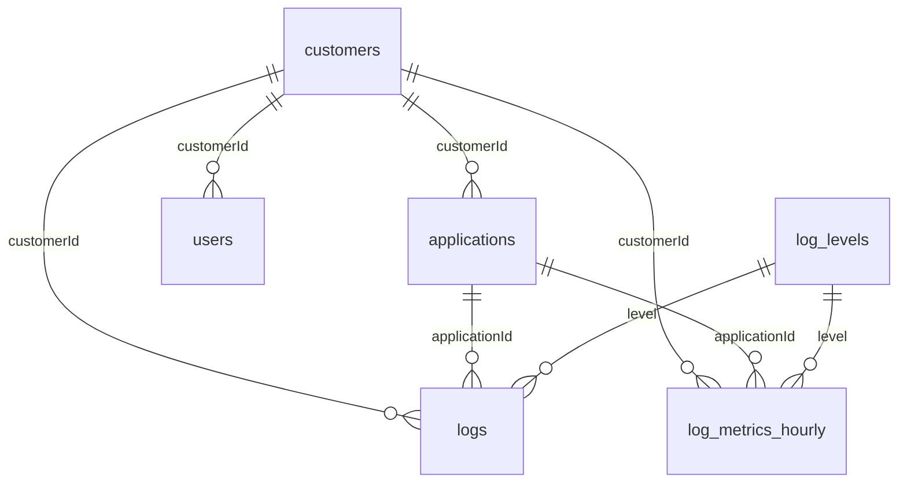

# Banco de dados (MongoDB)

O schema do MongoDB é código Python: um módulo por coleção em [`app/infrastructure/mongodb/ddl/`](../../app/infrastructure/mongodb/ddl/), com validator (`$jsonSchema`), collation e índices. O `migrate` aplica tudo com o `AsyncMongoClient` ([ADR-020](../../.ai/architecture.md#adr-020--schema-do-banco-como-código-python-assíncrono)).

Contrato da API: [`docs/api`](../api/README.md) · Decisões: [`.ai/architecture.md`](../../.ai/architecture.md) · Regras: [`.ai/business-rules.md`](../../.ai/business-rules.md).

## Como aplicar

| Onde | Como |
|---|---|
| Ambiente local | `scripts/startup.sh`. O serviço `migrate` do `compose.yaml` aplica o schema e termina; a API só sobe se ele terminar sem erro |
| Reaplicar à mão | `docker compose run --rm migrate` |
| Fora do Docker | `MONGODB_URI=mongodb://host:27017/log_api uv run python -m app.infrastructure.mongodb.migrate` |
| Testes (ADR-014) | `await apply_schema(db)` na fixture do Testcontainers: os testes rodam com os mesmos validators, índices únicos e TTL |

O `migrate` é idempotente: cria as coleções que faltam, reaplica os validators (`collMod`) e cria os índices que faltam, com as coleções em paralelo. Ele não resolve sozinho dois casos:

- **Collation de uma coleção existente:** o MongoDB não a altera. Se `users` já existir sem a collation do schema, o `migrate` para com erro; é preciso recriar a coleção e copiar os documentos.
- **Índice com o mesmo nome e outra definição:** o `create_indexes` falha. Mudar um índice é criar um com nome novo e apagar o antigo depois.

Todas as coleções usam `validationLevel: strict` e `validationAction: error`: documento fora do schema é recusado (erro 121), não só registrado.

| Arquivo | Conteúdo |
|---|---|
| `app/domain/log_level.py` | `LogLevel`, fonte dos valores de `level` |
| `app/domain/constraints.py` | Limites que a validação da API e o banco compartilham (tags, retenção) |
| `app/infrastructure/mongodb/client.py` | `create_mongo_client`, a única forma de criar o cliente |
| `app/infrastructure/mongodb/ddl/*.py` | Um módulo por coleção: `NAME`, `VALIDATOR`, `INDEXES`, `SPEC` |
| `app/infrastructure/mongodb/migrate.py` | `apply_schema(db)` e o ponto de entrada `python -m` |

## Modelo dimensional (star schema)



| Papel | Coleção ou campo | Grão |
|---|---|---|
| Fato (evento) | `logs` | Um documento por log recebido |
| Fato agregado (proposta) | `log_metrics_hourly` | Um documento por cliente × aplicação × ambiente × nível × hora |
| Dimensão | `customers`, `applications`, `log_levels` | Uma linha por cliente, aplicação ou nível |
| Dimensão degenerada | `environment`, `correlationId` | Sem coleção própria |
| Dimensão de tempo | `occurredAt`, `bucketStart` | Sem coleção própria |
| Fora do modelo | `users` | Acesso ao painel |

Onde o star schema entra e onde não entra ([ADR-021](../../.ai/architecture.md#adr-021--modelo-dimensional-star-schema-onde-há-agregação)):

- **Entra nas agregações do painel.** Recontar logs a cada gráfico varre a janela inteira na coleção mais volumosa e disputa o banco com a ingestão. `log_metrics_hourly` guarda as contagens por hora: um gráfico lê no máximo um documento por hora e combinação de aplicação, ambiente e nível, em vez de todos os logs do período.
- **Não entra na listagem de logs.** Separar `logs` em fato + dimensões obrigaria um `$lookup` em toda listagem, e o MongoDB não tem os joins de um data warehouse. Por isso o fato `logs` guarda cópias de atributos das dimensões (`applicationName`, `tags`), como decidido no ADR-003. A cópia registra o valor no momento do evento, que é o certo para histórico: o log antigo continua com o nome antigo da aplicação.
- **Sem dimensão de data.** `$dateTrunc` e `$dateToParts` (com fuso) fazem o papel de uma `dim_date`, que obrigaria um `$lookup`.
- **Tags fora do agregado.** São multivaloradas: entrariam como tabela ponte e multiplicariam os documentos. O filtro por tags consulta `logs` pelo índice multikey.
- **O agregado guarda só as chaves.** O nome da aplicação vem da dimensão, numa segunda consulta em paralelo (`asyncio.gather`). É barato, porque o resultado agregado é pequeno, e mostra o nome atual no gráfico.
- **Horas em UTC.** O painel monta dias em qualquer fuso de hora inteira (ex.: UTC−3); fusos de meia hora não fecham.
- **Alertas leem `logs`.** Janelas de minutos consultam os índices de nível direto; o agregado por hora é grosso demais para elas.

### Atualização do agregado

`refresh_log_metrics(db, received_since)` recalcula as horas que receberam logs desde `received_since`:

1. Acha os pares (cliente, hora de `occurredAt`) dos logs que chegaram na janela, pelo índice de `_id`. O `ObjectId` guarda o instante da gravação, então logs atrasados (`occurredAt` antigo) também são encontrados.
2. Para cada cliente, recalcula essas horas inteiras a partir de `logs` e grava com `$merge` (`whenMatched: replace`) na chave única do grão.

É idempotente: janelas sobrepostas não contam duas vezes. Sugestão até o painel ser definido: rodar a cada minuto com `received_since` = última execução − 1 minuto. É um job da plataforma, a única leitura de `logs` sem filtro por `customerId`; ele não é exposto a usuários e grava os agregados sempre separados por cliente.

## Coleções

Campos em `camelCase` no banco e `snake_case` no contrato ([ADR-018](../../.ai/architecture.md#adr-018--json-da-api-em-snake_case)). Todo campo é obrigatório no documento; o que é opcional no contrato é gravado como `null`.

### `customers`

| Campo | BSON | Python (leitura) | Contrato | Regra |
|---|---|---|---|---|
| `_id` | objectId | `ObjectId` | `id` (texto) | |
| `name` | string | `str` | `name` | Não vazio |
| `isActive` | bool | `bool` | `is_active` | |
| `retentionDays` | int (32 bits) | `int` | `retention_days` | 1 a 3650 |
| `createdAt` | date | `datetime` UTC | `created_at` | |

### `users`

Collation da coleção `{ locale: "en", strength: 2 }`: toda comparação de texto ignora maiúsculas.

| Campo | BSON | Python (leitura) | Contrato | Regra |
|---|---|---|---|---|
| `_id` | objectId | `ObjectId` | `id` | |
| `customerId` | objectId | `ObjectId` | — | Não sai da API |
| `name` | string | `str` | `name` | Não vazio |
| `email` | string | `str` | `email` | Até 254 caracteres; único sem diferenciar maiúsculas; gravado como digitado |
| `passwordHash` | string | `str` | — | Começa com `$argon2id$`: senha em texto é recusada. Não sai da API |
| `createdAt` | date | `datetime` UTC | `created_at` | |

### `applications`

| Campo | BSON | Python (leitura) | Contrato | Regra |
|---|---|---|---|---|
| `_id` | objectId | `ObjectId` | `id` | |
| `customerId` | objectId | `ObjectId` | — | Não sai da API |
| `name` | string | `str` | `name` | Único no cliente, sem diferenciar maiúsculas |
| `apiKeys` | array de object | `list[dict]` | `api_keys` | Pode ser vazio |
| `apiKeys[].keyHash` | string | `str` | — | Único entre aplicações. Não sai da API |
| `apiKeys[].prefix` | string | `str` | `prefix` | Não vazio |
| `apiKeys[].expiresAt` | date ou null | `datetime \| None` | `expires_at` | |
| `apiKeys[].revokedAt` | date ou null | `datetime \| None` | `revoked_at` | |
| `tags` | array de string | `list[str]` | `tags` | Até 20, `chave:valor` normalizada, até 100 caracteres, sem repetição |
| `createdAt` | date | `datetime` UTC | `created_at` | |

### `logs`

| Campo | BSON | Python (leitura) | Contrato | Regra |
|---|---|---|---|---|
| `_id` | objectId | `ObjectId` | `id` | |
| `customerId` | objectId | `ObjectId` | — | Não sai da API |
| `applicationId` | objectId | `ObjectId` | `application_id` | |
| `applicationName` | string | `str` | `application_name` | Cópia de `applications.name` |
| `correlationId` | binData (subtipo 4) ou null | `UUID \| None` | `correlation_id` | |
| `level` | int (32 bits) | `int` → `LogLevel(level)` | `level` | 0 a 5; `4.0` (double) é recusado |
| `message` | string | `str` | `message` | Não vazio |
| `exception` | string ou null | `str \| None` | `exception` | |
| `environment` | string | `str` | `environment` | Não vazio |
| `informationData` | object ou null | `dict \| None` | `information_data` | Livre, já mascarado |
| `tags` | array de string | `list[str]` | `tags` | Lista final: até 40 (20 da aplicação + 20 do log) |
| `occurredAt` | date | `datetime` UTC | `occurred_at` | |
| `receivedAt` | date | `datetime` UTC | `received_at` | |
| `expireAt` | date | `datetime` UTC | `expire_at` | Entre 1 e 3650 dias depois de `receivedAt` (checado com `$expr`) |

### `log_levels`

Carregada pelo `migrate` a partir de `LogLevel`: `{ _id: 0, name: "TRACE" }` até `{ _id: 5, name: "CRITICAL" }`. O backend usa o enum e não lê esta coleção; ela serve a quem consulta o banco fora do Python (BI, Compass, `mongosh`).

### `log_metrics_hourly` (proposta)

| Campo | BSON | Regra |
|---|---|---|
| `_id` | objectId | Gerado pelo `$merge` |
| `customerId`, `applicationId` | objectId | |
| `environment` | string | |
| `level` | int | 0 a 5 |
| `bucketStart` | date | Início da hora, em UTC |
| `count` | int ou long | Pelo menos 1 |
| `expireAt` | date | O maior `expireAt` dos logs da hora: o agregado some junto com o último log |

### Índices

| Coleção | Nome | Chave e opções | Consulta atendida |
|---|---|---|---|
| `users` | `users_email_unique` | `{ email: 1 }` único (collation da coleção) | Login e e-mail único |
| `users` | `users_customer` | `{ customerId: 1 }` | `GET /users` |
| `applications` | `applications_apiKeys_keyHash_unique` | `{ "apiKeys.keyHash": 1 }` único, parcial (`$exists: true`) | `POST /auth/token` |
| `applications` | `applications_customer_name_unique` | `{ customerId: 1, name: 1 }` único, collation strength 2 | Nome único (409) e `GET /applications` |
| `logs` | `logs_customer_occurred` | `{ customerId: 1, occurredAt: -1, _id: -1 }` | Listagem padrão, período, cursor |
| `logs` | `logs_customer_level_occurred` | `{ customerId: 1, level: 1, occurredAt: -1, _id: -1 }` | `min_level` sem aplicação |
| `logs` | `logs_customer_application_level_occurred` | `{ customerId: 1, applicationId: 1, level: 1, occurredAt: -1, _id: -1 }` | Aplicação, com ou sem nível |
| `logs` | `logs_customer_correlation_occurred` | `{ customerId: 1, correlationId: 1, occurredAt: -1, _id: -1 }`, parcial (só com `correlationId`) | `correlation_id` |
| `logs` | `logs_customer_tags_occurred` | `{ customerId: 1, tags: 1, occurredAt: -1, _id: -1 }` (multikey) | `tags` |
| `logs` | `logs_expire_ttl` | `{ expireAt: 1 }`, `expireAfterSeconds: 0` | Retenção (RN-08) |
| `log_metrics_hourly` | `log_metrics_hourly_grain_unique` | `{ customerId: 1, bucketStart: -1, applicationId: 1, environment: 1, level: 1 }` único | Chave do `$merge`; painel por período |
| `log_metrics_hourly` | `log_metrics_hourly_expire_ttl` | `{ expireAt: 1 }`, `expireAfterSeconds: 0` | Retenção dos agregados |

Mudanças em relação aos índices do documento do sistema, todas verificadas com `explain`:

- **`apiKeys.keyHash` parcial.** Num índice único comum, duas aplicações sem chave colidem no valor nulo, e o contrato cria a aplicação sem chaves: a segunda aplicação daria erro 11000.
- **`_id` no fim dos índices de listagem.** Logs com o mesmo `occurredAt` (mesmo milissegundo) são comuns. Sem desempate, a paginação por cursor pula ou repete logs.
- **Índice de nível sem aplicação.** `min_level` é um filtro independente no contrato. Sem ele, "só erros de todas as aplicações" varre os logs do cliente até achar a página.
- **`correlationId` parcial e ordenado.** A maioria dos logs não tem `correlationId`, e esses não entram no índice. O filtro parcial é `$gte: BinData(0, "")`: com `$type: "binData"` o MongoDB não usa o índice na busca por um UUID (testado: COLLSCAN).
- **Índices de `log_metrics_hourly`:** chave única do `$merge` e TTL.

## Leitura pelo backend Python

Pontos que o schema não resolve sozinho e que o backend precisa seguir. Os marcados com (testado) foram confirmados no MongoDB 8.0 com PyMongo 4.18.

### 1. Um cliente, uma configuração

Criar o cliente só com `create_mongo_client(uri)`, uma vez por processo, no `lifespan` do FastAPI. Sem `uuidRepresentation="standard"`, gravar um `UUID` falha e ler devolve `bson.Binary`; sem `tz_aware=True`, as datas voltam sem fuso. O `AsyncMongoClient` pertence ao event loop em que foi criado: nos testes, criar um cliente por loop.

### 2. Datas em milissegundos (testado)

O BSON guarda datas em milissegundos, e `datetime.now(UTC)` tem microssegundos: `…09.110775` volta do banco como `…09.110000`. Truncar antes de gravar (`dt.replace(microsecond=dt.microsecond // 1000 * 1000)`), para a resposta do `POST /logs` bater com o `GET` e o cursor comparar o mesmo valor que está no banco. Um `datetime` sem fuso é gravado como se fosse UTC, sem aviso: `occurred_at` usa `AwareDatetime` no Pydantic.

### 3. Tipos numéricos (testado)

- O PyMongo grava `int` como int32 quando cabe e int64 quando não. `level` e `retentionDays` exigem int32, então `4.0` é recusado. `LogLevel` é gravado como int; na leitura, `LogLevel(doc["level"])`.
- Um inteiro acima de 64 bits em `information_data` estoura no driver (`OverflowError`) antes de chegar ao banco. Tratar como 422, senão vira 500.
- Números com casa decimal viram double (`149.9` é aproximado). Valor monetário exato deve vir como texto no `information_data`.

### 4. `information_data` é responsabilidade da API (testado)

- O limite de 64 KB é medido no tamanho BSON (`len(bson.encode(...))`), não no JSON.
- O MongoDB 8 aceita chaves com `$` e `.` em subdocumentos: o `{"a": {"$where": 1}}` foi gravado. A RN-05 depende só da checagem na API, em todos os níveis.
- O BSON aceita no máximo 100 níveis de aninhamento; recusar antes com 422.
- `message` e `exception` não têm limite no contrato. Um log acima de 16 MB falha no driver com `DocumentTooLarge` (500). Está nos pontos em aberto.

### 5. Todos os campos, opcional como `null` (testado)

O validator exige todos os campos do log; um opcional ausente é recusado. Mapear campo a campo e não usar `model_dump(exclude_none=True)`: ele apagaria também os `None` de dentro de `information_data` e mudaria o dado enviado pelo cliente.

### 6. Conversões na camada de persistência

- `_id` ↔ `id` e `camelCase` ↔ `snake_case` só nessa camada.
- `ObjectId` ↔ `str` só nas bordas. Id vindo da URL passa por `ObjectId.is_valid()` antes da consulta; inválido responde 404, e não 500 (`InvalidId`).

### 7. Erros do banco → HTTP

- `DuplicateKeyError` (11000): o índice violado está em `err.details["keyPattern"]` e no nome do índice na mensagem. `users_email_unique` e `applications_customer_name_unique` → 409.
- `WriteError` 121 (documento fora do schema) é bug de mapeamento → 500. O `errInfo` traz os valores recusados; não escrever o conteúdo inteiro no log da aplicação, porque pode ter dado sensível.

### 8. Consulta de logs (testado com `explain`)

```python
query: dict[str, Any] = {"customerId": customer_id}  # sempre (RN-09)
if min_level is not None or application_id is not None:
    # $in, não $gte: com $in o índice entrega cada nível já ordenado por data; com $gte há sort em memória
    floor = min_level if min_level is not None else LogLevel.TRACE
    query["level"] = {"$in": [int(level) for level in LogLevel if level >= floor]}
if application_id is not None:
    query["applicationId"] = application_id
if correlation_id is not None:
    query["correlationId"] = correlation_id  # uuid.UUID
if tags:
    query["tags"] = {"$all": tags}  # normalizadas como na ingestão
period = {}
if occurred_from is not None:
    period["$gte"] = occurred_from
if occurred_to is not None:
    period["$lt"] = occurred_to
if cursor is not None:  # (occurred_at, id) do último log da página anterior
    period["$lte"] = cursor.occurred_at
    query["$nor"] = [{"occurredAt": cursor.occurred_at, "_id": {"$gte": cursor.id}}]
if period:
    query["occurredAt"] = period

sort = [("occurredAt", -1), ("_id", -1)]
docs = await db.logs.find(query).sort(sort).limit(limit + 1).to_list()
has_next = len(docs) > limit  # o item a mais só indica que há próxima página
```

O cursor leva `occurred_at` e `id` do último item. O `$nor` descarta os logs do mesmo milissegundo que já saíram, sem trocar o intervalo do índice por um `$or`.

### 9. Collation

- `users`: automática. `find_one({"email": email})` ignora maiúsculas e usa o índice único sem passar `collation` (testado).
- `applications`: consulta por nome precisa passar `collation=applications.NAME_COLLATION`, senão o índice não é usado. A busca por `apiKeys.keyHash` nunca leva collation.

### 10. API keys (testado)

- `find_one({"apiKeys.keyHash": key_hash})` usa o índice parcial.
- Índice único não vale dentro do mesmo documento. Gerar chave com `update_one({"_id": app_id, "apiKeys.prefix": {"$ne": prefix}}, {"$push": {"apiKeys": key}})` e conferir `modified_count`.
- Revogar com `update_one({"_id": app_id, "apiKeys.prefix": prefix}, {"$set": {"apiKeys.$.revokedAt": now}})`.

### 11. O TTL não é imediato (testado)

O monitor TTL roda a cada 60 segundos e atrasa sob carga: um log vencido ainda aparece por alguns instantes. Se o painel não puder mostrá-lo, somar `expireAt > agora` ao filtro (predicado barato, fora do índice).

### 12. Sem transações

O MongoDB do `compose.yaml` é um nó único, sem replica set. `POST /customers` grava em `customers` e `users` sem atomicidade: checar o e-mail antes e apagar o cliente se o usuário falhar. Um replica set de um nó habilitaria transações e change streams (úteis para alertas); está nos pontos em aberto.

### 13. Async

- `find_one`, `insert_one`, `update_one`, `aggregate`, `count_documents` e `list_collections` são coroutines (`await`).
- `find()` não é coroutine: devolve um `AsyncCursor` para `async for` ou `await cursor.to_list(n)`.
- Nunca usar o `pymongo.MongoClient` síncrono numa rota: ele bloqueia o event loop.
- `with pymongo.timeout(s):` limita o tempo de todas as operações do bloco, como no `/health`.
